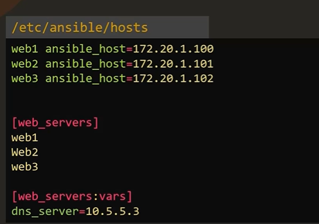

1. Add variable in playbook
```yaml
-
  name: add dns server to resolv.cong
  hosts: localhost
  vars:
    dns_server: 10.1.65.12
  tasks:
    - lineinfile:
        path: /etc/resov.conf
        line: 'nameserver {{ dns_server }}'
```
2. Define variable using separate file varibales names web.yaml
```
varibale1: value1
variable2: value2
```

3. define variable in inventory file
```
web http_port=8082 snmp_port=161-162 inter_ip_range=192.168.0.1
```
- variable define at group level

```ini
localhost ansible_connection=local nameserver_ip=8.8.8.8 snmp_port=160-161
node01 ansible_host=node01 ansible_ssh_pass=caleston123
node02 ansible_host=node02 ansible_ssh_pass=caleston123
[web_nodes]
node01
node02

[all:vars]
app_list=['vim', 'sqlite', 'jq']
user_details={'username': 'admin', 'password': 'secret_pass', 'email': 'admin@example.com'}
```

- variable defien at host take presedence

4. define variable at command
```
ansible-playbook playbook.yaml --extra-vars "dns_server=10.1.1.1"
```

### Types of Variable
1. stirng
2. Number
3. Boolean
4. List
5. Distionary

#### Hish priorioty variable
- low to high in image


### magic variable
#### variable define at web1 host level work for all host using magic variable
inventory
```
web1 ansible_host=web.server.com dns_server=10.2.2.2
db1 ansible_host=db.server.com
```
playbook
```
- 
  name: print dns server
  hosts: all
  tasks:
    - debug:
        msg: {{ hostvars['web1'].dns_server }}
```