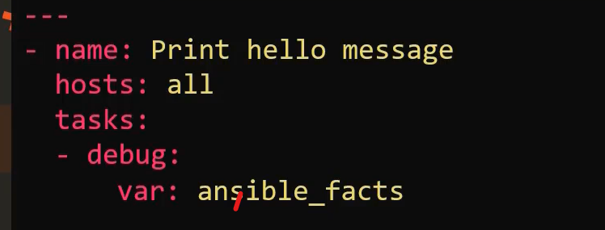

1. Ansible gather facts using setup module
2. setup module play by default
3. ansible stores all the facts in varibae called "ansible_facts"
4. playbook for get ansible facts

5. To skip gathering facts task , add in playbook
```
gather_facts: no
```
6. also disbale gatheirng facts from make gethering= explicit in ansible.cfg file


```json
"ansible_facts": {
    "all_ipv4_addresses": [
        "172.31.38.136"
    ],
    "all_ipv6_addresses": [
        "fe80::8a:39ff:feff:92ec"
    ],
    "ansible_local": {},
    "apparmor": {
        "status": "disabled"
    },
    "architecture": "x86_64",
    "bios_date": "08/24/2006",
    "bios_vendor": "Xen",
    "bios_version": "4.11.amazon",
    "board_asset_tag": "NA",
    "board_name": "NA",
    "board_serial": "NA",
    "board_vendor": "NA",
    "board_version": "NA",
    "chassis_asset_tag": "NA",
    "chassis_serial": "NA",
    "chassis_vendor": "Xen",
    "chassis_version": "NA",
    "cmdline": {
        "BOOT_IMAGE": "(hd0,gpt1)/boot/vmlinuz-6.1.27-43.48.amzn2023.x86_64",
        "console": "ttyS0,115200n8",
        "nvme_core.io_timeout": "4294967295",
        "quiet": true,
        "rd.emergency": "poweroff",
        "rd.shell": "0",
        "ro": true,
        "root": "UUID=55a1aebd-f196-4f84-8afe-075f5d1dda63",
        "security": "selinux",
        "selinux": "1"
    },
    "date_time": {
        "date": "2023-06-03",
        "day": "03",
        "epoch": "1685784228",
        "epoch_int": "1685784228",
        "hour": "09",
        "iso8601": "2023-06-03T09:23:48Z",
        "iso8601_basic": "20230603T092348132202",
        "iso8601_basic_short": "20230603T092348",
        "iso8601_micro": "2023-06-03T09:23:48.132202Z",
        "minute": "23",
        "month": "06",
        "second": "48",
        "time": "09:23:48",
        "tz": "UTC",
        "tz_dst": "UTC",
        "tz_offset": "+0000",
        "weekday": "Saturday",
        "weekday_number": "6",
        "weeknumber": "22",
        "year": "2023"
    },
    "default_ipv4": {
        "address": "172.31.38.136",
        "alias": "enX0",
        "broadcast": "",
        "gateway": "172.31.32.1",
        "interface": "enX0",
        "macaddress": "02:8a:39:ff:92:ec",
        "mtu": 9001,
        "netmask": "255.255.240.0",
        "network": "172.31.32.0",
        "prefix": "20",
        "type": "ether"
    },
    "default_ipv6": {},
    "device_links": {
        "ids": {},
        "labels": {
            "xvda1": [
                "\\x2f"
            ]
        },
        "masters": {},
        "uuids": {
            "xvda1": [
                "55a1aebd-f196-4f84-8afe-075f5d1dda63"
            ],
            "xvda128": [
                "0383-1543"
            ]
        }
    },
    "devices": {
        "xvda": {
            "holders": [],
            "host": "",
            "links": {
                "ids": [],
                "labels": [],
                "masters": [],
                "uuids": []
            },
            "model": null,
            "partitions": {
                "xvda1": {
                    "holders": [],
                    "links": {
                        "ids": [],
                        "labels": [
                            "\\x2f"
                        ],
                        "masters": [],
                        "uuids": [
                            "55a1aebd-f196-4f84-8afe-075f5d1dda63"
                        ]
                    },
                    "sectors": "16752607",
                    "sectorsize": 512,
                    "size": "7.99 GB",
                    "start": "24576",
                    "uuid": "55a1aebd-f196-4f84-8afe-075f5d1dda63"
                },
                "xvda127": {
                    "holders": [],
                    "links": {
                        "ids": [],
                        "labels": [],
                        "masters": [],
                        "uuids": []
                    },
                    "sectors": "2048",
                    "sectorsize": 512,
                    "size": "1.00 MB",
                    "start": "22528",
                    "uuid": null
                },
                "xvda128": {
                    "holders": [],
                    "links": {
                        "ids": [],
                        "labels": [],
                        "masters": [],
                        "uuids": [
                            "0383-1543"
                        ]
                    },
                    "sectors": "20480",
                    "sectorsize": 512,
                    "size": "10.00 MB",
                    "start": "2048",
                    "uuid": "0383-1543"
                }
            },
            "removable": "0",
            "rotational": "0",
            "sas_address": null,
            "sas_device_handle": null,
            "scheduler_mode": "mq-deadline",
            "sectors": "16777216",
            "sectorsize": "512",
            "size": "8.00 GB",
            "support_discard": "0",
            "vendor": null,
            "virtual": 1
        }
    },
    "discovered_interpreter_python": "/usr/bin/python3.9",
    "distribution": "Amazon",
    "distribution_file_parsed": true,
    "distribution_file_path": "/etc/os-release",
    "distribution_file_variety": "Amazon",
    "distribution_major_version": "2023",
    "distribution_minor_version": "NA",
    "distribution_release": "NA",
    "distribution_version": "2023",
    "dns": {
        "nameservers": [
            "172.31.0.2"
        ],
        "search": [
            "ap-south-1.compute.internal"
        ]
    },
    "domain": "ap-south-1.compute.internal",
    "effective_group_id": 0,
    "effective_user_id": 0,
    "enX0": {
        "active": true,
        "device": "enX0",
        "features": {
            "esp_hw_offload": "off [fixed]",
            "esp_tx_csum_hw_offload": "off [fixed]",
            "fcoe_mtu": "off [fixed]",
            "generic_receive_offload": "on",
            "generic_segmentation_offload": "on",
            "highdma": "off [fixed]",
            "hsr_dup_offload": "off [fixed]",
            "hsr_fwd_offload": "off [fixed]",
            "hsr_tag_ins_offload": "off [fixed]",
            "hsr_tag_rm_offload": "off [fixed]",
            "hw_tc_offload": "off [fixed]",
            "l2_fwd_offload": "off [fixed]",
            "large_receive_offload": "off [fixed]",
            "loopback": "off [fixed]",
            "macsec_hw_offload": "off [fixed]",
            "netns_local": "off [fixed]",
            "ntuple_filters": "off [fixed]",
            "receive_hashing": "off [fixed]",
            "rx_all": "off [fixed]",
            "rx_checksumming": "on [fixed]",
            "rx_fcs": "off [fixed]",
            "rx_gro_hw": "off [fixed]",
            "rx_gro_list": "off",
            "rx_udp_gro_forwarding": "off",
            "rx_udp_tunnel_port_offload": "off [fixed]",
            "rx_vlan_filter": "off [fixed]",
            "rx_vlan_offload": "off [fixed]",
            "rx_vlan_stag_filter": "off [fixed]",
            "rx_vlan_stag_hw_parse": "off [fixed]",
            "scatter_gather": "on",
            "tcp_segmentation_offload": "on",
            "tls_hw_record": "off [fixed]",
            "tls_hw_rx_offload": "off [fixed]",
            "tls_hw_tx_offload": "off [fixed]",
            "tx_checksum_fcoe_crc": "off [fixed]",
            "tx_checksum_ip_generic": "off [fixed]",
            "tx_checksum_ipv4": "on [fixed]",
            "tx_checksum_ipv6": "on",
            "tx_checksum_sctp": "off [fixed]",
            "tx_checksumming": "on",
            "tx_esp_segmentation": "off [fixed]",
            "tx_fcoe_segmentation": "off [fixed]",
            "tx_gre_csum_segmentation": "off [fixed]",
            "tx_gre_segmentation": "off [fixed]",
            "tx_gso_list": "off [fixed]",
            "tx_gso_partial": "off [fixed]",
            "tx_gso_robust": "on [fixed]",
            "tx_ipxip4_segmentation": "off [fixed]",
            "tx_ipxip6_segmentation": "off [fixed]",
            "tx_lockless": "off [fixed]",
            "tx_nocache_copy": "off",
            "tx_scatter_gather": "on",
            "tx_scatter_gather_fraglist": "off [fixed]",
            "tx_sctp_segmentation": "off [fixed]",
            "tx_tcp6_segmentation": "on",
            "tx_tcp_ecn_segmentation": "off [fixed]",
            "tx_tcp_mangleid_segmentation": "off",
            "tx_tcp_segmentation": "on",
            "tx_tunnel_remcsum_segmentation": "off [fixed]",
            "tx_udp_segmentation": "off [fixed]",
            "tx_udp_tnl_csum_segmentation": "off [fixed]",
            "tx_udp_tnl_segmentation": "off [fixed]",
            "tx_vlan_offload": "off [fixed]",
            "tx_vlan_stag_hw_insert": "off [fixed]",
            "vlan_challenged": "off [fixed]"
        },
        "hw_timestamp_filters": [],
        "ipv4": {
            "address": "172.31.38.136",
            "broadcast": "",
            "netmask": "255.255.240.0",
            "network": "172.31.32.0",
            "prefix": "20"
        },
        "ipv6": [
            {
                "address": "fe80::8a:39ff:feff:92ec",
                "prefix": "64",
                "scope": "link"
            }
        ],
        "macaddress": "02:8a:39:ff:92:ec",
        "module": "xen_netfront",
        "mtu": 9001,
        "pciid": "vif-0",
        "promisc": false,
        "timestamping": [],
        "type": "ether"
    },
    "env": {
        "HOME": "/root",
        "LANG": "C.UTF-8",
        "LOGNAME": "root",
        "LS_COLORS": "rs=0:di=01;34:ln=01;36:mh=00:pi=40;33:so=01;35:do=01;35:bd=40;33;01:cd=40;33;01:or=40;31;01:mi=01;37;41:su=37;41:sg=30;43:ca=30;41:tw=30;42:ow=34;42:st=37;44:ex=01;32:*.tar=01;31:*.tgz=01;31:*.arc=01;31:*.arj=01;31:*.taz=01;31:*.lha=01;31:*.lz4=01;31:*.lzh=01;31:*.lzma=01;31:*.tlz=01;31:*.txz=01;31:*.tzo=01;31:*.t7z=01;31:*.zip=01;31:*.z=01;31:*.dz=01;31:*.gz=01;31:*.lrz=01;31:*.lz=01;31:*.lzo=01;31:*.xz=01;31:*.zst=01;31:*.tzst=01;31:*.bz2=01;31:*.bz=01;31:*.tbz=01;31:*.tbz2=01;31:*.tz=01;31:*.deb=01;31:*.rpm=01;31:*.jar=01;31:*.war=01;31:*.ear=01;31:*.sar=01;31:*.rar=01;31:*.alz=01;31:*.ace=01;31:*.zoo=01;31:*.cpio=01;31:*.7z=01;31:*.rz=01;31:*.cab=01;31:*.wim=01;31:*.swm=01;31:*.dwm=01;31:*.esd=01;31:*.jpg=01;35:*.jpeg=01;35:*.mjpg=01;35:*.mjpeg=01;35:*.gif=01;35:*.bmp=01;35:*.pbm=01;35:*.pgm=01;35:*.ppm=01;35:*.tga=01;35:*.xbm=01;35:*.xpm=01;35:*.tif=01;35:*.tiff=01;35:*.png=01;35:*.svg=01;35:*.svgz=01;35:*.mng=01;35:*.pcx=01;35:*.mov=01;35:*.mpg=01;35:*.mpeg=01;35:*.m2v=01;35:*.mkv=01;35:*.webm=01;35:*.webp=01;35:*.ogm=01;35:*.mp4=01;35:*.m4v=01;35:*.mp4v=01;35:*.vob=01;35:*.qt=01;35:*.nuv=01;35:*.wmv=01;35:*.asf=01;35:*.rm=01;35:*.rmvb=01;35:*.flc=01;35:*.avi=01;35:*.fli=01;35:*.flv=01;35:*.gl=01;35:*.dl=01;35:*.xcf=01;35:*.xwd=01;35:*.yuv=01;35:*.cgm=01;35:*.emf=01;35:*.ogv=01;35:*.ogx=01;35:*.aac=01;36:*.au=01;36:*.flac=01;36:*.m4a=01;36:*.mid=01;36:*.midi=01;36:*.mka=01;36:*.mp3=01;36:*.mpc=01;36:*.ogg=01;36:*.ra=01;36:*.wav=01;36:*.oga=01;36:*.opus=01;36:*.spx=01;36:*.xspf=01;36:",
        "MAIL": "/var/mail/root",
        "PATH": "/usr/local/sbin:/usr/local/bin:/usr/sbin:/usr/bin:/sbin:/bin:/var/lib/snapd/snap/bin",
        "PWD": "/home/ec2-user",
        "SHELL": "/bin/bash",
        "SHLVL": "0",
        "SUDO_COMMAND": "/bin/sh -c echo BECOME-SUCCESS-zpujscwphggutbseqsqkbdqiurnkzmkj ; /usr/bin/python3.9 /home/ec2-user/.ansible/tmp/ansible-tmp-1685784226.2613456-1257-208451097631784/AnsiballZ_setup.py",
        "SUDO_GID": "1000",
        "SUDO_UID": "1000",
        "SUDO_USER": "ec2-user",
        "TERM": "xterm-256color",
        "USER": "root",
        "_": "/usr/bin/python3.9"
    },
    "fibre_channel_wwn": [],
    "fips": false,
    "form_factor": "Other",
    "fqdn": "ip-172-31-38-136.ap-south-1.compute.internal",
    "gather_subset": [
        "all"
    ],
    "hostname": "ip-172-31-38-136",
    "hostnqn": "",
    "interfaces": [
        "enX0",
        "lo"
    ],
    "is_chroot": false,
    "iscsi_iqn": "",
    "kernel": "6.1.27-43.48.amzn2023.x86_64",
    "kernel_version": "#1 SMP PREEMPT_DYNAMIC Tue May  2 04:53:36 UTC 2023",
    "lo": {
        "active": true,
        "device": "lo",
        "features": {
            "esp_hw_offload": "off [fixed]",
            "esp_tx_csum_hw_offload": "off [fixed]",
            "fcoe_mtu": "off [fixed]",
            "generic_receive_offload": "on",
            "generic_segmentation_offload": "on",
            "highdma": "on [fixed]",
            "hsr_dup_offload": "off [fixed]",
            "hsr_fwd_offload": "off [fixed]",
            "hsr_tag_ins_offload": "off [fixed]",
            "hsr_tag_rm_offload": "off [fixed]",
            "hw_tc_offload": "off [fixed]",
            "l2_fwd_offload": "off [fixed]",
            "large_receive_offload": "off [fixed]",
            "loopback": "on [fixed]",
            "macsec_hw_offload": "off [fixed]",
            "netns_local": "on [fixed]",
            "ntuple_filters": "off [fixed]",
            "receive_hashing": "off [fixed]",
            "rx_all": "off [fixed]",
            "rx_checksumming": "on [fixed]",
            "rx_fcs": "off [fixed]",
            "rx_gro_hw": "off [fixed]",
            "rx_gro_list": "off",
            "rx_udp_gro_forwarding": "off",
            "rx_udp_tunnel_port_offload": "off [fixed]",
            "rx_vlan_filter": "off [fixed]",
            "rx_vlan_offload": "off [fixed]",
            "rx_vlan_stag_filter": "off [fixed]",
            "rx_vlan_stag_hw_parse": "off [fixed]",
            "scatter_gather": "on",
            "tcp_segmentation_offload": "on",
            "tls_hw_record": "off [fixed]",
            "tls_hw_rx_offload": "off [fixed]",
            "tls_hw_tx_offload": "off [fixed]",
            "tx_checksum_fcoe_crc": "off [fixed]",
            "tx_checksum_ip_generic": "on [fixed]",
            "tx_checksum_ipv4": "off [fixed]",
            "tx_checksum_ipv6": "off [fixed]",
            "tx_checksum_sctp": "on [fixed]",
            "tx_checksumming": "on",
            "tx_esp_segmentation": "off [fixed]",
            "tx_fcoe_segmentation": "off [fixed]",
            "tx_gre_csum_segmentation": "off [fixed]",
            "tx_gre_segmentation": "off [fixed]",
            "tx_gso_list": "on",
            "tx_gso_partial": "off [fixed]",
            "tx_gso_robust": "off [fixed]",
            "tx_ipxip4_segmentation": "off [fixed]",
            "tx_ipxip6_segmentation": "off [fixed]",
            "tx_lockless": "on [fixed]",
            "tx_nocache_copy": "off [fixed]",
            "tx_scatter_gather": "on [fixed]",
            "tx_scatter_gather_fraglist": "on [fixed]",
            "tx_sctp_segmentation": "on",
            "tx_tcp6_segmentation": "on",
            "tx_tcp_ecn_segmentation": "on",
            "tx_tcp_mangleid_segmentation": "on",
            "tx_tcp_segmentation": "on",
            "tx_tunnel_remcsum_segmentation": "off [fixed]",
            "tx_udp_segmentation": "on",
            "tx_udp_tnl_csum_segmentation": "off [fixed]",
            "tx_udp_tnl_segmentation": "off [fixed]",
            "tx_vlan_offload": "off [fixed]",
            "tx_vlan_stag_hw_insert": "off [fixed]",
            "vlan_challenged": "on [fixed]"
        },
        "hw_timestamp_filters": [],
        "ipv4": {
            "address": "127.0.0.1",
            "broadcast": "",
            "netmask": "255.0.0.0",
            "network": "127.0.0.0",
            "prefix": "8"
        },
        "ipv6": [
            {
                "address": "::1",
                "prefix": "128",
                "scope": "host"
            }
        ],
        "mtu": 65536,
        "promisc": false,
        "timestamping": [],
        "type": "loopback"
    },
    "lsb": {},
    "machine": "x86_64",
    "machine_id": "2a9a5c47580d481db1ef6bb12e855a04",
    "memfree_mb": 565,
    "memory_mb": {
        "nocache": {
            "free": 784,
            "used": 165
        },
        "real": {
            "free": 565,
            "total": 949,
            "used": 384
        },
        "swap": {
            "cached": 0,
            "free": 0,
            "total": 0,
            "used": 0
        }
    },
    "memtotal_mb": 949,
    "module_setup": true,
    "mounts": [
        {
            "block_available": 1689005,
            "block_size": 4096,
            "block_total": 2077691,
            "block_used": 388686,
            "device": "/dev/xvda1",
            "fstype": "xfs",
            "inode_available": 4141520,
            "inode_total": 4188096,
            "inode_used": 46576,
            "mount": "/",
            "options": "rw,seclabel,noatime,attr2,inode64,logbufs=8,logbsize=32k,sunit=1024,swidth=1024,noquota",
            "size_available": 6918164480,
            "size_total": 8510222336,
            "uuid": "55a1aebd-f196-4f84-8afe-075f5d1dda63"
        }
    ],
    "nodename": "ip-172-31-38-136.ap-south-1.compute.internal",
    "os_family": "RedHat",
    "pkg_mgr": "dnf",
    "proc_cmdline": {
        "BOOT_IMAGE": "(hd0,gpt1)/boot/vmlinuz-6.1.27-43.48.amzn2023.x86_64",
        "console": [
            "tty0",
            "ttyS0,115200n8"
        ],
        "nvme_core.io_timeout": "4294967295",
        "quiet": true,
        "rd.emergency": "poweroff",
        "rd.shell": "0",
        "ro": true,
        "root": "UUID=55a1aebd-f196-4f84-8afe-075f5d1dda63",
        "security": "selinux",
        "selinux": "1"
    },
    "processor": [
        "0",
        "GenuineIntel",
        "Intel(R) Xeon(R) CPU E5-2676 v3 @ 2.40GHz"
    ],
    "processor_cores": 1,
    "processor_count": 1,
    "processor_nproc": 1,
    "processor_threads_per_core": 1,
    "processor_vcpus": 1,
    "product_name": "HVM domU",
    "product_serial": "ec26da7c-9314-b102-5854-130dab9288c7",
    "product_uuid": "ec26da7c-9314-b102-5854-130dab9288c7",
    "product_version": "4.11.amazon",
    "python": {
        "executable": "/usr/bin/python3.9",
        "has_sslcontext": true,
        "type": "cpython",
        "version": {
            "major": 3,
            "micro": 16,
            "minor": 9,
            "releaselevel": "final",
            "serial": 0
        },
        "version_info": [
            3,
            9,
            16,
            "final",
            0
        ]
    },
    "python_version": "3.9.16",
    "real_group_id": 0,
    "real_user_id": 0,
    "selinux": {
        "config_mode": "permissive",
        "mode": "permissive",
        "policyvers": 33,
        "status": "enabled",
        "type": "targeted"
    },
    "selinux_python_present": true,
    "service_mgr": "systemd",
    "ssh_host_key_ecdsa_public": "AAAAE2VjZHNhLXNoYTItbmlzdHAyNTYAAAAIbmlzdHAyNTYAAABBBLdlb0ha4Pou6MkUQTRq4bdYK43K3U3b/cRl7Y6KBwy5hhs4uIFz4fvZLf5YhM+nr7wcdKtNUWcrbVg1R18sAG8=",
    "ssh_host_key_ecdsa_public_keytype": "ecdsa-sha2-nistp256",
    "ssh_host_key_ed25519_public": "AAAAC3NzaC1lZDI1NTE5AAAAIG247fLTmXE2C5KTfuZaok92EXeWMp7oGvr38EvgCoby",
    "ssh_host_key_ed25519_public_keytype": "ssh-ed25519",
    "swapfree_mb": 0,
    "swaptotal_mb": 0,
    "system": "Linux",
    "system_capabilities": [],
    "system_capabilities_enforced": "False",
    "system_vendor": "Xen",
    "uptime_seconds": 1551,
    "user_dir": "/root",
    "user_gecos": "root",
    "user_gid": 0,
    "user_id": "root",
    "user_shell": "/bin/bash",
    "user_uid": 0,
    "userspace_architecture": "x86_64",
    "userspace_bits": "64",
    "virtualization_role": "guest",
    "virtualization_tech_guest": [
        "xen"
    ],
    "virtualization_tech_host": [],
    "virtualization_type": "xen"
}
```